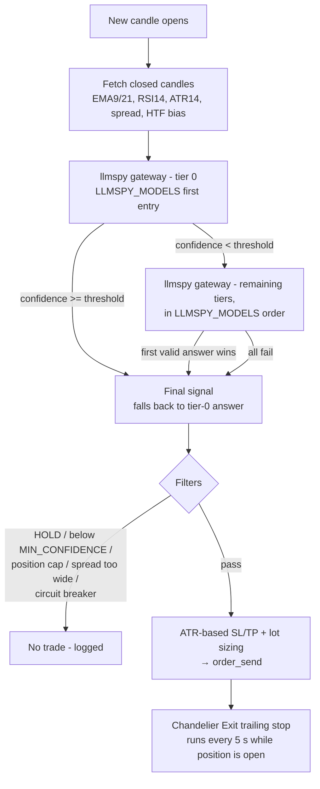

# LLM_Bot_FX

**Current version: 9.2** — see [`CHANGELOG.md`](CHANGELOG.md) for history. Filenames no longer carry a version suffix; the running version is tracked via `__version__` in `claude_bot.py`, printed at startup, and stamped on every order's comment field. Use git tags/releases to pin a specific version.

An experimental MetaTrader 5 trading daemon where an **LLM** proposes a trade *direction and conviction*, and **deterministic code** does everything that can lose money: position sizing, stop placement, spread filtering, trailing stops and the daily loss circuit breaker. Every model call — local or cloud — goes through a single gateway, **llmspy** (an OpenAI-chat-completions-compatible proxy in front of Ollama and any cloud backends), configured as an ordered chain of model names (`LLMSPY_MODELS`). A low-confidence answer from the first model in the chain is escalated to the next one, in order, for a second opinion.

> **Disclaimer — read this first.**
> This is research/hobby software, **not financial advice**. A small local LLM has no demonstrated statistical edge on raw price data, and nothing here has been backtested. Run it with `DRY_RUN=true`, then on a **demo account**, and treat every parameter as something to validate rather than trust. You are solely responsible for any losses. The software is provided as-is, with no warranty.

## Design principle

The model only ever answers `{"reasoning", "action": BUY|SELL|HOLD, "confidence": 0..1}`. It never sets price levels or lot sizes. Its output is validated and normalised (bad action → `HOLD`, confidence coerced to `[0,1]`) before anything downstream sees it.

## How it works


```mermaid
flowchart TD
    A[New candle opens] --> B[Fetch closed candles<br/>EMA9/21, RSI14, ATR14, spread, HTF bias]
    B --> C[llmspy gateway - tier 0<br/>LLMSPY_MODELS first entry]
    C -->|confidence >= threshold| F
    C -->|confidence < threshold| D[llmspy gateway - remaining tiers,<br/>in LLMSPY_MODELS order]
    D -->|first valid answer wins| F
    D -->|all fail| F[Final signal<br/>falls back to tier-0 answer]
    F --> G{Filters}
    G -->|HOLD / below MIN_CONFIDENCE /<br/>position cap / spread too wide /<br/>circuit breaker| X[No trade - logged]
    G -->|pass| H[ATR-based SL/TP + lot sizing<br/>→ order_send]
    H --> I[Chandelier Exit trailing stop<br/>runs every 5 s while position is open]
```

The main loop wakes every 5 seconds. On each pass it checks the MT5 connection, runs the circuit breaker, syncs closed deals into the risk state, and updates trailing stops. The LLM is only called on a **new candle**, in a background thread, so a slow model never leaves open positions unmanaged. If the previous request is still running when the next candle opens, that candle is skipped rather than stacking requests.

### Per-timeframe LLM budget

The budget bounds how long a slow request may delay a decision before it is abandoned as `HOLD`. Override with `LLM_MAX_LATENCY_SEC`.

| Timeframe | Candle | LLM budget |
|-----------|--------|-----------|
| M1  | 60 s    | 10 s |
| M5  | 300 s   | 20 s |
| M15 | 900 s   | 40 s |
| M30 | 1800 s  | 60 s |
| H1  | 3600 s  | 90 s |
| H4  | 14400 s | 90 s |

Higher-timeframe bias (EMA20 vs EMA50 + last close): M1–M30 → H1, H1 → H4, H4 → D1.

### Risk management

- **Initial SL/TP:** `ATR(14) × ATR_SL_MULTIPLIER` / `× ATR_TP_MULTIPLIER` from entry, set once, floored at the broker's minimum stop distance.
- **Chandelier Exit trailing stop:** once a position's *peak* profit reaches `TRAIL_ACTIVATION_ATR_MULT` ATR, the stop trails `CHANDELIER_ATR_MULT` ATR behind the highest (BUY) / lowest (SELL) price reached since entry. That watermark is persisted per ticket in `risk_state.json`. Stops and targets only ever move in the favourable direction. The TP is additionally extended (capped at `MAX_TP_EXTENSION_ATR_MULT` ATR from entry).
- **Progressive sizing** (only when `FIXED_LOT_SIZE=0`): start at `STARTING_RISK_PCT` of equity per trade, +`RISK_STEP_PCT` after every 5 consecutive net-positive closed trades, capped at `MAX_RISK_PCT`; two consecutive losses reset to the start. Net P&L includes commission and swap.
- **Spread guard:** a new trade is blocked if spread > 0.35 × ATR (pip fallback when ATR is unavailable).
- **Daily circuit breaker:** new trades are halted for the rest of the UTC day once drawdown from that day's starting equity reaches `DAILY_LOSS_LIMIT_PCT`. Existing positions keep being managed.
- **Position cap:** `MAX_POSITIONS_PER_DIRECTION` per direction (BUY and SELL counted separately), for this symbol and magic number.

## Requirements

- MetaTrader 5 terminal, **logged in, with Algo/Auto Trading enabled**
- Python for **Windows** with the `MetaTrader5` package. On Linux, run both MT5 and that Python inside a Wine prefix (this project's launcher does `wine python …`)
- A reachable **llmspy** gateway exposing an OpenAI-chat-completions-compatible endpoint (`.../v1/chat/completions`), fronting a local Ollama instance and/or cloud backends. This bot only ever calls llmspy directly — it holds no cloud API keys and never talks to Ollama's native API.
- Whatever llmspy needs on its own side to serve the model names you put in `LLMSPY_MODELS` (e.g. an Ollama instance with those models pulled, and/or cloud credentials configured in llmspy itself)

## Quick start

```bash
git clone <your-fork-url> LLM_Bot_FX && cd LLM_Bot_FX

# 1. Install dependencies into the Windows Python inside your Wine prefix
wine python -m pip install -r requirements.txt

# 2. Configure
cp .env.example .env
chmod 600 .env
$EDITOR .env          # set LLMSPY_BASE_URL, LLMSPY_MODELS, symbol, timeframe...

# 3. Launch (DRY_RUN=true by default: nothing is sent to the broker)
chmod +x claude_bot.sh
./claude_bot.sh
tail -f claude_bot.log
```

Stop it with `kill $(cat claude_bot.pid)` (graceful: finishes the current loop and shuts MT5 down cleanly).

On plain Windows, skip the shell script: set the same variables in your environment and run `python -u claude_bot.py`.

### Recommended rollout

1. `DRY_RUN=true` for several days. Read `trade_log.jsonl` and check the decisions make sense.
2. Demo account with `DRY_RUN=false`, `FIXED_LOT_SIZE=0.01`, `MAX_POSITIONS_PER_DIRECTION=1`.
3. Only then consider anything else, and never risk money you can't afford to lose.

## Configuration

All settings are environment variables, normally set in `.env` (see [`.env.example`](.env.example) for every option with comments). Precedence: **exported shell environment > `.env` > default**.

| Group | Variables |
|-------|-----------|
| Safety | `DRY_RUN` (default `true`), `FIXED_LOT_SIZE`, `MAX_POSITIONS_PER_DIRECTION`, `MIN_CONFIDENCE`, `DAILY_LOSS_LIMIT_PCT`, `MAGIC_NUMBER` |
| llmspy gateway | `LLMSPY_BASE_URL`, `LLMSPY_MODELS`, `LLMSPY_MAX_TOKENS`, `KEEP_LOCAL_ALIVE`, `LLM_MAX_LATENCY_SEC` |
| Market | `TRADE_SYMBOL`, `TRADE_TIMEFRAME`, `LOOKBACK_CANDLES` (≥ 22), `PROMPT_BARS`, `BROKER_UTC_OFFSET_HOURS` |
| Risk sizing | `STARTING_RISK_PCT`, `MAX_RISK_PCT`, `RISK_STEP_PCT` |
| Stops | `ATR_SL_MULTIPLIER`, `ATR_TP_MULTIPLIER`, `EXTENDED_TP_ATR_MULT`, `MAX_TP_EXTENSION_ATR_MULT`, `TRAIL_ACTIVATION_ATR_MULT`, `CHANDELIER_ATR_MULT` |
| Escalation | `ESCALATION_ENABLED`, `ESCALATION_CONFIDENCE_THRESHOLD`, `ESCALATION_SHARE_LOCAL_ANSWER`, `LLMSPY_TIMEOUT_SEC` |

Notes:

- `LLMSPY_MODELS` is an ordered, comma-separated list of model names — tier 0 first, e.g. `phi4-mini,gpt-oss-20b`. There's no separate "local" vs "cloud" config anymore: llmspy alone decides what each name resolves to. Add a third/fourth tier just by adding another name to the list.
- `KEEP_LOCAL_ALIVE` (minutes) is only sent on the tier-0 call, as Ollama's `keep_alive` field — it's meaningless for later (presumably cloud) tiers and is never sent for them.
- `LLMSPY_MAX_TOKENS` maps to the standard `max_tokens` chat-completions field. `num_ctx`/`num_thread` are **not** configurable from this bot — llmspy's chat-completions endpoint doesn't forward a nested Ollama `options` object, so those must be set on the llmspy/Ollama side directly.
- Reasoning ("thinking") models are supported — `<think>…</think>` blocks are stripped from any tier's answer.
- **Two thresholds interact:** `ESCALATION_CONFIDENCE_THRESHOLD` decides *whether to escalate to the next tier*; `MIN_CONFIDENCE` decides *whether the final answer (whichever tier it came from) trades*.
- `LLMSPY_TIMEOUT_SEC` bounds each individual call in the chain; the whole chain for one candle is additionally bounded by the per-timeframe `LLM_MAX_LATENCY_SEC` budget below, so a chain of slow tiers can't blow past the timeframe's decision budget.
- Changing `MAGIC_NUMBER` while positions are open orphans them: the bot only manages positions carrying its own magic number. **If you're upgrading from a build using magic number `260921`:** either close those positions first, or set `MAGIC_NUMBER=260921` until they're closed, then switch to the new default (`260922`).

## Files the bot writes

| File | Purpose |
|------|---------|
| `trade_log.jsonl` | Append-only audit log. Events: `signal`, `escalation`, `escalation_failed`, `escalation_exhausted`, `trade_attempt`, `order_rejected`, `trade_closed` |
| `risk_state.json` | Risk tier, win/loss streaks, daily start equity, circuit-breaker flag, deal cursor, per-ticket high/low watermarks |
| `claude_bot.log` | stdout/stderr of the daemon (from the launcher) |
| `claude_bot.pid` | PID written by the launcher |

All four are git-ignored.

## Troubleshooting

| Symptom | Likely cause |
|---------|--------------|
| `Order Send Failed (terminal-level, no result object)` | AutoTrading/Algo Trading disabled in the MT5 terminal, or the terminal isn't connected/logged in |
| Every signal is `HOLD` | `LOOKBACK_CANDLES` < 22, wrong `TRADE_SYMBOL` spelling, or the LLM is timing out (see the log) |
| Nothing is ever sent | `DRY_RUN` is still `true` (the default) |
| Escalation never happens | `LLMSPY_MODELS` has only one entry, `ESCALATION_ENABLED=false`, or tier-0 confidence is always ≥ the threshold |
| Signal always fails/HOLD with an escalation error | `LLMSPY_BASE_URL` unreachable, or a model name in `LLMSPY_MODELS` isn't one llmspy actually serves — check `claude_bot.log` for the HTTP error from llmspy |
| `Insufficient free margin` / lot = 0 | Account too small for the risk settings; check `FIXED_LOT_SIZE` / risk % |
| Garbled characters / crash on log output under Wine | Make sure `PYTHONUTF8=1` (the launcher sets it) |

## Known limitations

- **No backtester.** Nothing is validated on historical data; the JSONL log is intended as raw material for calibration.
- The trailing-stop watermark is sampled from ticks every 5 seconds, so a spike shorter than that is not captured.
- One symbol per process; run multiple instances with different `TRADE_SYMBOL` / `MAGIC_NUMBER` / working directories for more.
- The LLM sees only a handful of OHLC bars plus a few indicators. No news, no order flow.
- MetaTrader5's Python package is Windows-only, hence the Wine dependency on Linux.

## Security

- As of v9.2, this bot holds no cloud API keys at all — every model call goes through llmspy, which is the only thing that authenticates outward. Any credentials llmspy itself needs for its cloud backends live in llmspy's own configuration, not here.
- `.env` (git-ignored, `chmod 600`) is still where `LLMSPY_BASE_URL` and any other locally-sensitive values (e.g. an internal-only hostname) belong — never in tracked files.
- If a secret was ever committed in an earlier version, **rotate it**; deleting the file doesn't remove it from git history.

## Project layout

```
.
├── claude_bot.py     # the daemon
├── claude_bot.sh     # launcher (loads .env, sets defaults, runs under wine/nohup)
├── .env.example      # documented configuration template
├── requirements.txt
├── CHANGELOG.md
└── README.md
```
