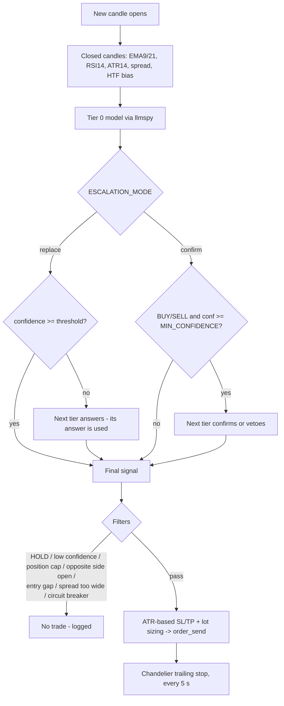

# LLM_Bot_FX

**Current version: 9.3** - see [`CHANGELOG.md`](CHANGELOG.md). The running version is `__version__` in `claude_bot.py`, printed at startup and stamped on every order's comment.

An experimental MetaTrader 5 trading daemon. One or more **LLMs (reached through a single llmspy / OpenAI-compatible gateway)** propose a trade *direction and conviction*; **deterministic code** does everything that can lose money: position sizing, stop placement, spread filtering, entry filters, trailing stops and the daily loss circuit breaker.

> **Disclaimer - read this first.**
> Research/hobby software, **not financial advice**. Nothing here has been backtested and the model has no demonstrated statistical edge. Run with `DRY_RUN=true`, then on a **demo account**. You are solely responsible for any losses. Provided as-is, without warranty.

## Design principle

The model only answers `{"reasoning", "action": BUY|SELL|HOLD, "confidence": 0..1}`. It never sets price levels or lot sizes. Output is validated and normalised (bad action -> `HOLD`, confidence coerced to `[0,1]`) before anything downstream sees it. BUY/SELL open a *new* position; HOLD means no new trade (the bot has no discretionary exits).

## How it works


```mermaid
flowchart TD
    A[New candle opens] --> B[Closed candles: EMA9/21, RSI14, ATR14, spread, HTF bias]
    B --> C[Tier 0 model via llmspy]
    C --> M{ESCALATION_MODE}
    M -->|replace| R{confidence >= threshold?}
    R -->|yes| F
    R -->|no| D[Next tier answers - its answer is used]
    D --> F[Final signal]
    M -->|confirm| K{BUY/SELL and conf >= MIN_CONFIDENCE?}
    K -->|no| F
    K -->|yes| V[Next tier confirms or vetoes]
    V --> F
    F --> G{Filters}
    G -->|HOLD / low confidence / position cap / opposite side open /<br/>entry gap / spread too wide / circuit breaker| X[No trade - logged]
    G -->|pass| H[ATR-based SL/TP + lot sizing -> order_send]
    H --> I[Chandelier trailing stop, every 5 s]
```

The main loop wakes every 5 s: checks the MT5 connection, runs the circuit breaker, syncs closed deals, updates trailing stops. The LLM chain runs only on a **new candle**, in a background thread, so a slow model never leaves positions unmanaged. If the previous request is still running at the next candle, that candle is skipped.

### Models and escalation

Models are configured **only** through `LLMSPY_MODELS` (comma-separated, tier 0 first); llmspy decides whether a name is local or cloud.

- **`replace` (default).** If tier 0's confidence is below `ESCALATION_CONFIDENCE_THRESHOLD` (default 0.80), the next tier is asked and its answer is used. A failing tier falls through to the next; if all later tiers fail, tier 0's answer is used. Every escalation writes both answers to `trade_log.jsonl`, which makes this mode ideal for **comparing two models**: with a tier-0 model that rarely reaches the threshold, the second model decides every candle and both opinions are recorded.
- **`confirm`.** Tier 0 decides. The next tier is only called when tier 0 wants to trade; disagreement -> HOLD, agreement -> confidence = min of both. The threshold is not used.
- **Single model.** With one entry in `LLMSPY_MODELS` there is no escalation.

The chain for one candle is bounded by a per-timeframe budget (M1 10 s, M5 20 s, M15 40 s, M30 60 s, H1/H4 90 s; override with `LLM_MAX_LATENCY_SEC`); each call is also capped by `LLMSPY_TIMEOUT_SEC`.

Higher-timeframe bias (EMA20 vs EMA50 + last close): M1-M30 -> H1, H1 -> H4, H4 -> D1.

### Risk management

- **Initial SL/TP:** `ATR(14) x ATR_SL_MULTIPLIER` / `x ATR_TP_MULTIPLIER`, set once, floored at the broker's minimum stop distance.
- **Chandelier trailing stop:** once a position's *peak* profit reaches `TRAIL_ACTIVATION_ATR_MULT` ATR, the stop trails `CHANDELIER_ATR_MULT` ATR behind the best price since entry (watermark persisted per ticket). SL/TP only move favourably. SL modifications are sent only when they improve by at least `TRAIL_SL_MIN_STEP_ATR_FRACTION` x ATR. Note: a very small `CHANDELIER_ATR_MULT` (< ~1.5) caps winners near the activation level; measure before using it.
- **Entry filters:** `MIN_CONFIDENCE`; `MAX_POSITIONS_PER_DIRECTION` (BUY and SELL counted separately); `BLOCK_OPPOSITE_SIDE` (no hedging); `MIN_ENTRY_GAP_MIN` between same-direction entries; spread guard (`MAX_SPREAD_ATR_RATIO`, pip fallback without ATR).
- **Progressive sizing** (only when `FIXED_LOT_SIZE=0`): starts at `STARTING_RISK_PCT`, +`RISK_STEP_PCT` per 5 net-positive closes, capped at `MAX_RISK_PCT`; two consecutive losses reset it.
- **Daily circuit breaker:** new trades halt for the rest of the UTC day at `DAILY_LOSS_LIMIT_PCT` drawdown. Open positions keep being managed.

## Requirements

- MetaTrader 5 terminal, **logged in, Algo Trading enabled**
- Python for **Windows** with `MetaTrader5` (on Linux: run MT5 and that Python inside a Wine prefix; the launcher does `wine python ...`)
- A reachable llmspy gateway (OpenAI-chat-completions compatible) that serves the models you list

## Quick start

```bash
git clone <your-fork-url> LLM_Bot_FX && cd LLM_Bot_FX
wine python -m pip install -r requirements.txt     # Windows Python inside your prefix
cp .env.example .env && chmod 600 .env
$EDITOR .env          # set LLMSPY_BASE_URL, LLMSPY_MODELS, symbol, WINEPREFIX ...
chmod +x claude_bot.sh && ./claude_bot.sh          # DRY_RUN=true by default
tail -f claude_bot.log
```

Stop with `kill $(cat claude_bot.pid)` (graceful). On plain Windows set the same variables and run `python -u claude_bot.py`.

### Recommended rollout

1. `DRY_RUN=true` for a day or more; read `trade_log.jsonl`.
2. **Demo account**, `DRY_RUN=false`, `FIXED_LOT_SIZE=0.01`, `MAX_POSITIONS_PER_DIRECTION=1`.
3. Run `eval_signals.py` after a few days (see below) before changing any parameter.

## Configuration

All settings are environment variables, normally in `.env` (see [`.env.example`](.env.example)). Precedence: **exported shell environment > `.env` > default**.

| Group | Variables |
|-------|-----------|
| Safety | `DRY_RUN` (default `true`), `FIXED_LOT_SIZE`, `DAILY_LOSS_LIMIT_PCT`, `MAGIC_NUMBER` |
| Gateway / models | `LLMSPY_BASE_URL`, `LLMSPY_MODELS`, `LLMSPY_MAX_TOKENS`, `LLMSPY_TIMEOUT_SEC`, `KEEP_LOCAL_ALIVE`, `LLM_MAX_LATENCY_SEC` |
| Escalation | `ESCALATION_ENABLED`, `ESCALATION_MODE`, `ESCALATION_CONFIDENCE_THRESHOLD`, `ESCALATION_SHARE_LOCAL_ANSWER` |
| Entry rules | `MIN_CONFIDENCE`, `MAX_POSITIONS_PER_DIRECTION`, `MIN_ENTRY_GAP_MIN`, `BLOCK_OPPOSITE_SIDE`, `MAX_SPREAD_ATR_RATIO` |
| Market / prompt | `TRADE_SYMBOL`, `TRADE_TIMEFRAME`, `LOOKBACK_CANDLES` (>= 22), `PROMPT_BARS`, `PROMPT_INCLUDE_POSITIONS`, `BROKER_UTC_OFFSET_HOURS` |
| Risk sizing | `STARTING_RISK_PCT`, `MAX_RISK_PCT`, `RISK_STEP_PCT` |
| Stops / trailing | `ATR_SL_MULTIPLIER`, `ATR_TP_MULTIPLIER`, `EXTENDED_TP_ATR_MULT`, `MAX_TP_EXTENSION_ATR_MULT`, `TRAIL_ACTIVATION_ATR_MULT`, `CHANDELIER_ATR_MULT`, `TRAIL_SL_MIN_STEP_ATR_FRACTION` |

Notes:

- Two thresholds interact: `ESCALATION_CONFIDENCE_THRESHOLD` decides *whether to ask the next tier* (replace mode); `MIN_CONFIDENCE` decides *whether the final answer trades*.
- MT5 bar times are **broker server time**, not UTC. Set `BROKER_UTC_OFFSET_HOURS` (e.g. `-3` for a UTC+3 broker) so the timestamps in the prompt are real UTC; it is display-only.
- Changing `MAGIC_NUMBER` while positions are open orphans them.
- `num_ctx` / `num_thread` are not forwarded by llmspy; configure them on the gateway side.

## Files the bot writes

| File | Purpose |
|------|---------|
| `trade_log.jsonl` | Append-only audit log. Events: `signal`, `escalation`, `confirmation`, `escalation_failed`, `escalation_exhausted`, `trade_attempt`, `trade_opened`, `order_rejected`, `trade_closed`, `position_peak` |
| `risk_state.json` | Risk tier, streaks, daily start equity, breaker flag, deal cursor, per-ticket watermarks |
| `claude_bot.log` | stdout/stderr of the daemon |
| `claude_bot.pid` | PID written by the launcher |

All four are git-ignored. `trade_opened.ticket` equals the position ticket used by trailing-stop messages; `trade_closed.position_id` links a close back to it.

## Comparing models offline

`eval_signals.py` (run with the Windows Python next to `trade_log.jsonl`) scores **every** logged signal, including HOLDs and filtered ones, against real M15 prices: hit rate and mean forward return after 1/2/4 bars for tier 0, the escalation model and a plain EMA9>EMA21 rule, plus the unconditional drift as a baseline. If the model is no better than the rule, the LLM adds cost, not edge. Set `EVAL_SERVER_OFFSET_H` (broker server time minus UTC) if bars are not found.

## Troubleshooting

| Symptom | Likely cause |
|---------|--------------|
| `Order Send Failed (terminal-level, no result object)` | AutoTrading disabled in MT5, or the terminal is not connected/logged in |
| Every signal is `HOLD` | `LOOKBACK_CANDLES` < 22, wrong `TRADE_SYMBOL`, or the gateway is failing (see the log) |
| Nothing is ever sent | `DRY_RUN` is `true` (the default) |
| No escalation | Single entry in `LLMSPY_MODELS`, `ESCALATION_ENABLED=false`, or tier 0 always >= threshold |
| Almost no trades in `confirm` mode | Tier 0 rarely reaches `MIN_CONFIDENCE`; check `signal` events |
| Model answers lack `action` | Model ignores the JSON contract; use a different model or a schema-enforcing gateway setting |
| `Insufficient free margin` / lot = 0 | Account too small for the risk settings |
| Garbled output / crash under Wine | Ensure `PYTHONUTF8=1` (the launcher sets it) |

## Known limitations

- No backtester; the JSONL log plus `eval_signals.py` is the calibration path.
- The trailing watermark is sampled every 5 s.
- One symbol per process (use separate directories and `MAGIC_NUMBER`s for more).
- The model sees a few OHLC bars and a few indicators: no news, no order flow.
- A single trend leg can dominate results; judge by many independent trades, not a few correlated ones.
- MetaTrader5's Python package is Windows-only, hence Wine on Linux.

## Security

- Keep secrets out of tracked files. This bot holds no provider API keys; only the gateway URL and wine paths live in `.env`, which is git-ignored (`chmod 600`). Commit only `.env.example`.

## Project layout

```
.
├── claude_bot.py       # the daemon
├── claude_bot.sh       # launcher (loads .env, sets defaults, runs under wine/nohup)
├── eval_signals.py     # offline scoring of logged signals
├── .env.example        # documented configuration template
├── requirements.txt
├── CHANGELOG.md
└── README.md
```
